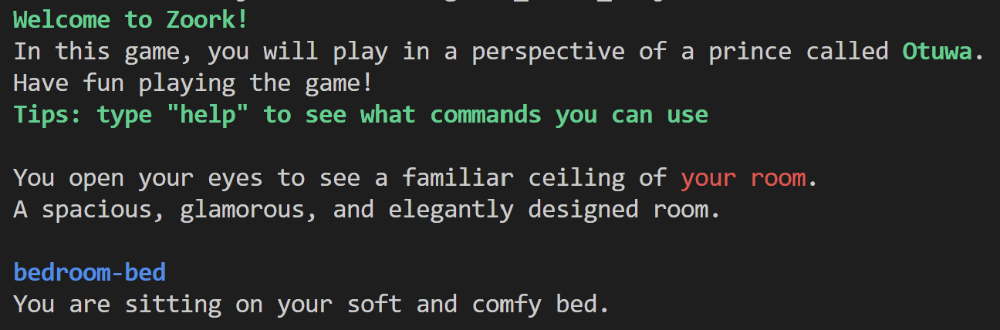
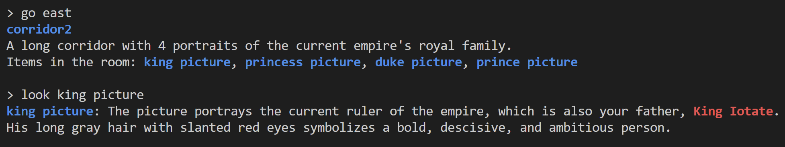
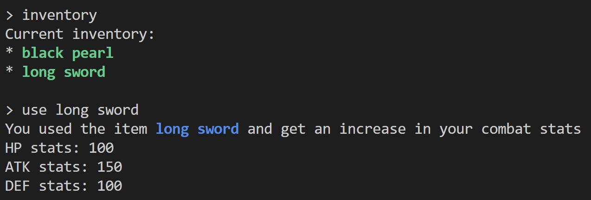
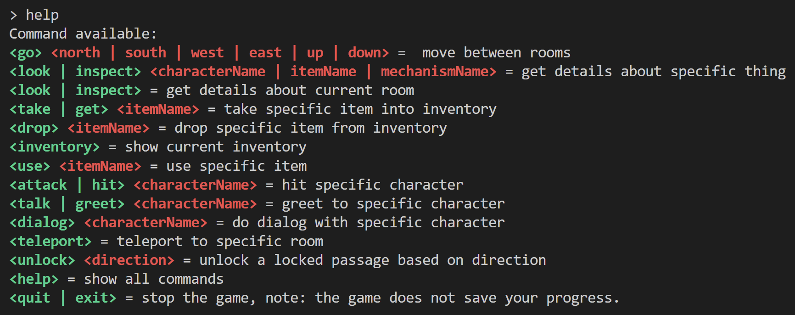

# PSD-Final-Project
CSE3PSD/CSE5008 Programming Assignment 3A - Zork-Style Adventure

**Name:** Ellis Raputri

**Class:** LT6O

**ID Number:** 2702298116

<br>

## Project Description
This project consists of a command-line built game, replicating the legendary game (Zork). The game includes a story, with several action that can player do. The actions include: 
- (go) (north | south | west | east | up | down) =  move between rooms
- (look | inspect) (characterName | itemName | mechanismName) = get details about specific thing
- (look | inspect) = get details about current room 
- (take | get) (itemName) = take specific item into inventory
- (drop) (itemName) = drop specific item from inventory 
- (inventory) = show current inventory
- (use) (itemName) = use specific item
- (attack | hit) (characterName) = hit specific character
- (talk | greet) (characterName) = greet to specific character
- (dialog) (characterName) = do dialog with specific character
- (teleport) = teleport to specific room
- (unlock) (direction) = unlock a locked passage based on direction
- (help) = show all commands
- (quit | exit) = stop the game, note: the game does not save your progress.

<br>

## How to Play 
- Install C++ and CMake on your computer. 
- Clone the repository or download the ZIP file.
- Build the code using CMake with the commands below.
    ```
    mkdir build
    cd build
    cmake ..
    cmake --build .
    ```
- Run the application.
    ```
    Debug\PSD_Final_Project.exe
    ```
- Enjoy the game!

<br>

## Screenshots 
<br><br>
<br><br>
<br><br>
<br><br>

